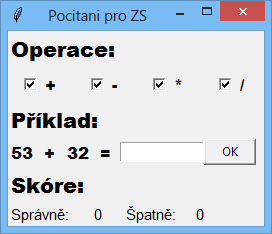

# PRG -- počítání ZŠ

* Aplikace umožňuje procvičování základních matematických operací
* Umožňuje generovat příklady na sčítání, odčítání násobení a dělení (bezezbytku) do sta
* Uživatel si volí, jaké matematické operace chce procvičovat
* Ve spodní části je zobrazeno uživatelovo skóre, tedy počet správných a chybných výsledků
* K vygenerování nového příkladu dojde až po zadání správného výsledku, žádný příklad nelze přeskočit
* Pokud uživatel omylem napíše do výsledkového pole jiný znak, než číslo a výsledek potvrdí, dostane další pokus a chyba je mu odpuštěna
* Výsledky je možné potvrzovat buď myší, kliknutím na tlačítko OK (pro masochisty), nebo pohodlněji, pomocí enteru na klávesnici

## Ukázka grafického rozhraní

## Studijní materiály
* https://www.tutorialspoint.com/python/python_gui_programming.htm
